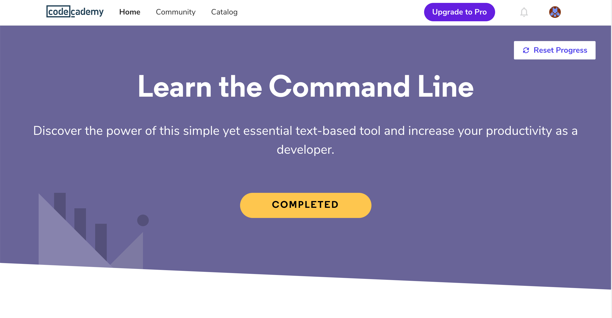
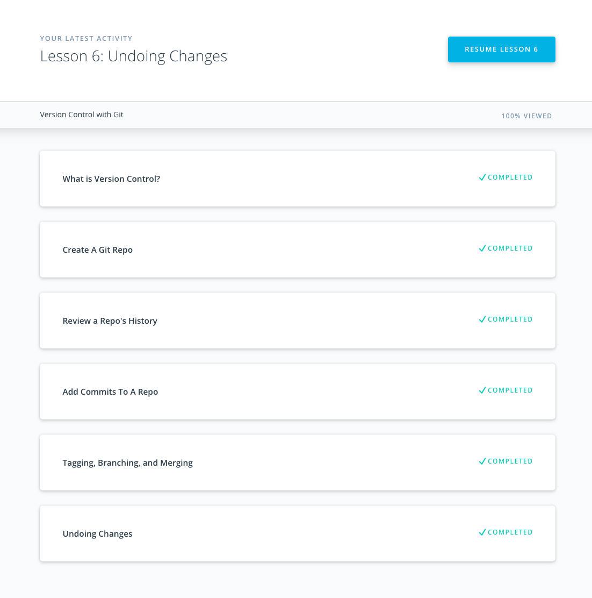
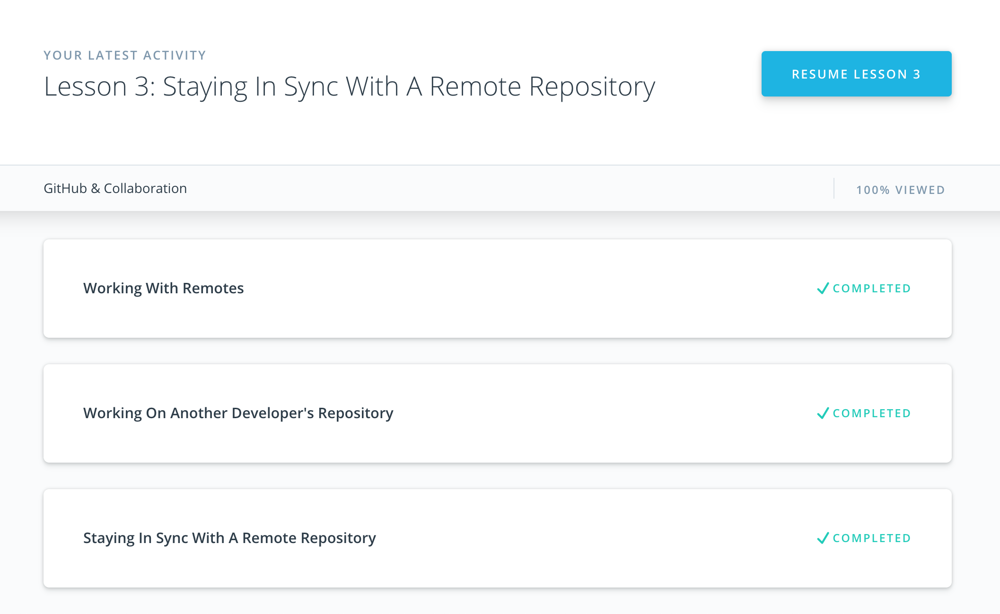
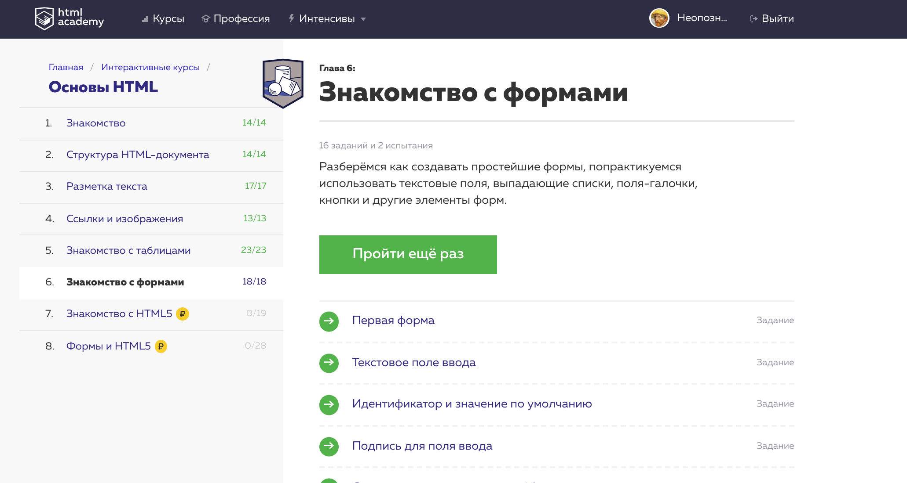
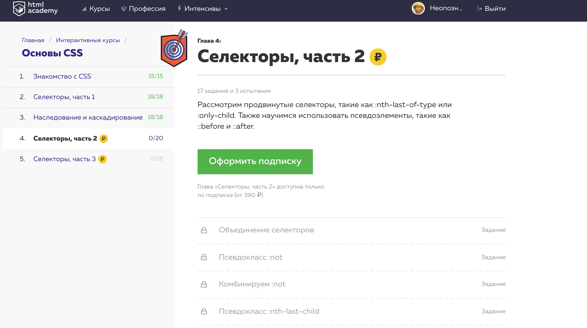
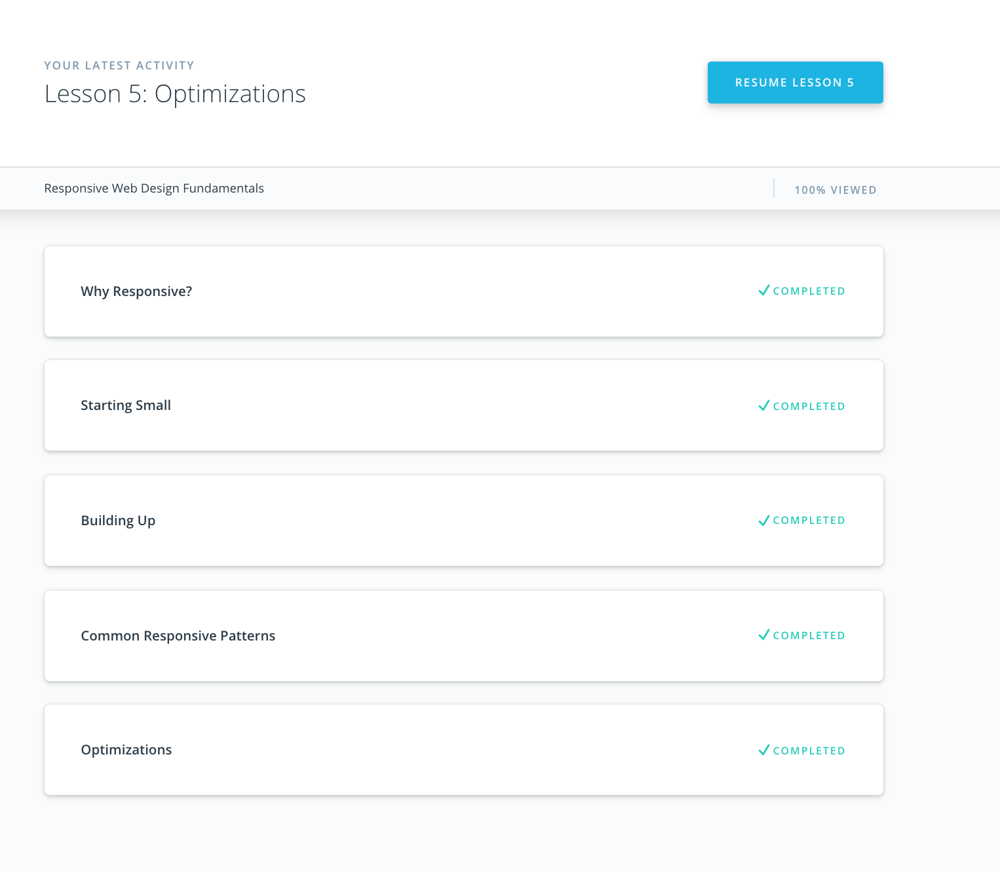
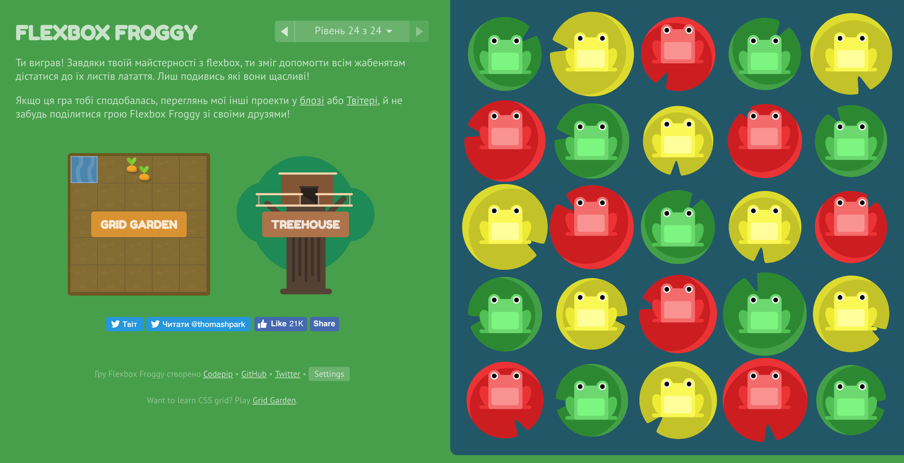

## Git and GitHub

In the course i didn't learn something new, but I refreshed my memory about some git stuff. Also I setuped properly my git_profile.

## Linux CLI, and HTTP

I am using CLI for lots of actions, so i am familiar with part of course. I found interesting to learn about redirecting input and output, grep and sed commands. 
Also i read good articles with short explanation of HTTP. It was helpfull for me to structure information.

## Git Collaboration

I found few new option for commands, and have good review of git basics. Also I understand rebase command for squashing commit.

## Intro to HTML and CSS

Just refreshed my memory about HTML and CSS stuff.

## Responsive Web Design

Also this theme i have refreshed in my memories. It was good for me to recall about responsive design patterns and optimization. And it was second time when i finished Flexbox Froggy game.