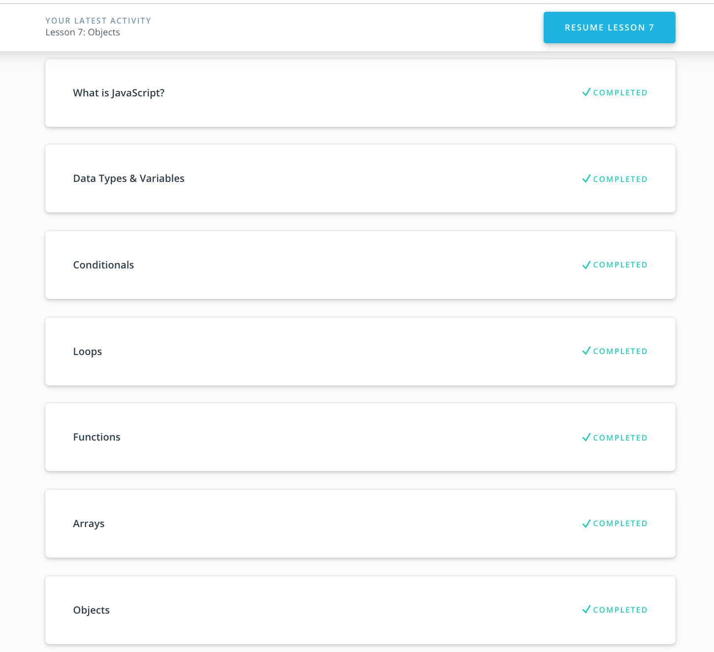

## Git and GitHub

In the course i didn't learn something new, but I refreshed my memory about some git stuff. Also I setuped properly my git_profile.

## Linux CLI, and HTTP

I am using CLI for lots of actions, so i am familiar with part of course. I found interesting to learn about redirecting input and output, grep and sed commands. 
Also i read good articles with short explanation of HTTP. It was helpfull for me to structure information.

## Git Collaboration

I found few new option for commands, and have good review of git basics. Also I understand rebase command for squashing commit.

## Intro to HTML and CSS

Just refreshed my memory about HTML and CSS stuff.

## Responsive Web Design

Also this theme i have refreshed in my memories. It was good for me to recall about responsive design patterns and optimization. And it was second time when i finished Flexbox Froggy game.

## JS Basics

I renewed basic things about js in this course and had a good practice in codecamp. It was interesting to compare my code with provided solution and analyze what was bad and good point in my coding. And it was powerfull to watch Data Structures and Algorithms in JavaScript.

## DOM

A good course to repeat knowledge about DOM. I got a few forgotten things in "Performance part". It was also interesting to solve Codecamp's tasks, however it was more easy rather previous.

Practical task

[Demo](https://olek557.github.io/kottans-frontend/task_js_dom/practical_task/index.html) |
[Code base](https://github.com/olek557/kottans-frontend/tree/master/task_js_dom/practical_task)

Reviewed and approved by @zonzujiro

I really enjoy first practical task and it's really helpful when mentors make comments and show problems, better choices or best practices.

## A Tiny JS World

[Demo](https://olek557.github.io/a-tiny-JS-world/) |
[Code base](https://github.com/olek557/a-tiny-JS-world/tree/populate-world)

Reviewed and approved by @OleksiyRudenko

When i have finished task I felt that it need to implement it with help of OOP. Now i am waiting to rewrite this stuff. Also I thank @OleksiyRudenko for showing my mistakes.

## Object Oriented JS

[Codewars profile](https://www.codewars.com/users/olek557557/)

It was very interesting to dig into oop. I found this course helpful to understand scopes, closures, prototypes and patterns. It's cool idea to play with frogger game, easy implemented objects and you have simple game.  And it was interesting to look into engine.js and understand how it's work.  In codewars i finished few kata with 7 and 8 kyu difficulty, it was easy but good js training. I will come back to try more dificult tasks.

Reviewed and approved by @OleksiyRudenko

## OOP Exercise

[Demo](https://olek557.github.io/a-tiny-JS-world/) |
[Code base](https://github.com/olek557/a-tiny-JS-world/tree/populate-world-oop)

It was interesting to rewrite code with oop principles. I try ES6 classes and will use it in future. Also get lot of cool things from @OleksiyRudenko.

Reviewed and approved by @OleksiyRudenko

## Memory Pair Game

[Demo](https://olek557.github.io/memory-game/) |
[Code base](https://github.com/olek557/memory-game)

Reviewed and approved by @AMashoshyna

It's awesome to make own game. I learn how to shuffle array, implement game with oop and dealt with flipping animation. Want to improve my game with more beautiful front side of cards and few logic things.
